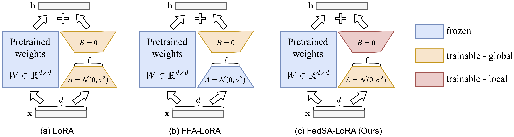

# FedSA-LoRA

The implementation of [Selective Aggregation for Low-Rank Adaptation in Federated Learning](https://openreview.net/forum?id=iX3uESGdsO) [ICLR 2025]. \
[Pengxin Guo](https://pengxin-guo.github.io), [Shuang Zeng](https://scholar.google.com/citations?user=yTP1oqkAAAAJ&hl=en), Yanran Wang, Huijie Fan, Feifei Wang, and [Liangqiong Qu](https://liangqiong.github.io).

 

##### Figure 1. The illustration of (a) LoRA, (b) FFA-LoRA, and (c) FedSA-LoRA. In LoRA, both $A$ and $B$ matrices are trainable and shared with the server for aggregation. In FFA-LoRA, only $B$ matrices are trainable and shared with the server for aggregation, while $A$ matrices are fixed after initialization. In FedSA-LoRA, both $A$ and $B$ matrices are trainable, but only $A$ matrices are shared with the server for aggregation while $B$ matrices are kept locally.


## Installation

Our code is based on Python version 3.10 and PyTorch version 2.1.0. 
You can install all the dependencies with the following command:
```shell
conda create -n fedsa-lora python=3.10
conda activate fedsa-lora
conda install pytorch==2.1.0 torchvision==0.16.0 torchaudio==2.1.0 pytorch-cuda=12.1 -c pytorch -c nvidia
pip install -e .[llm]
```

## Training

Now, we can fine-tune a LLM with FedSA-LoRA:

```shell
python federatedscope/main.py --cfg federatedscope/glue/yamls/fedsa-lora.yaml
```

## Acknowledgement

We would like to thank the authors for releasing the public repository: [FederatedScope-LLM](https://github.com/alibaba/FederatedScope/tree/llm).